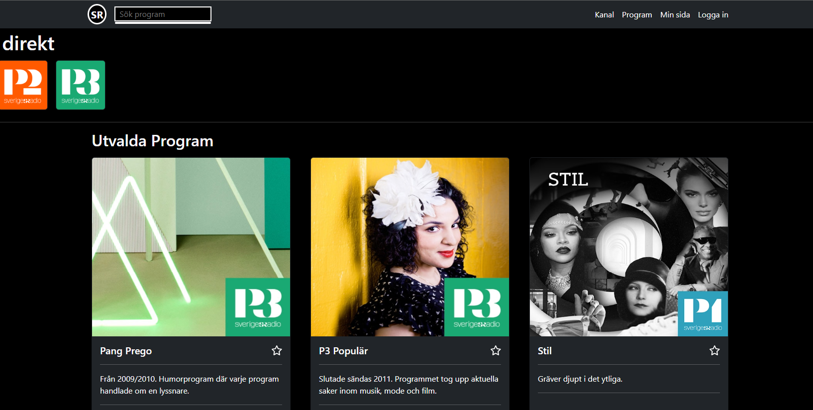

# Radio App

This is a project that is part of the Technigo bootcamp. The project is to build a radio app using the Sveriges Radio API. The app should be able to show a list of channels, programs and categories. 

## Live Demo

You can view a live demo of the project [here](https://cloticc.github.io/lexicon-react-radio-app/)

## Installation

To run this project locally, follow these steps:

1. Clone the repository
2. Install the dependencies with `npm install`
3. Start the development server with `npm run dev`

# Exercise React Radio

In this exercise you will create a Radio application that is using the "Sveriges Radios öppna API". To your help you have this scaffolded repo that includes React Router and Sass. The React router you will need in order to handle the different pages/views but Sass is something that is optional for you.

[Here is a live example of a radio application built with this API](https://sradio.onrender.com/)

<figure>
  
</figure>

The API you can find on this link: [Sveriges Radio öppna API](https://sverigesradio.se/api/documentation/v2/index.html)

This API returns XML per default but it can be configure via query parameters to return json instead.

Below you will find a set of user stories that you will follow in order to complete this exercise.

The interpretation of these user stories are rather free and how you decide to showcase them is entirely up to you.

- As a user I want to be able to see a list of all the channels.
- As a user I want to be able to see all the programs on a given channel during "today" and also be able to see what airs "tomorrow" and maybe some day later in the week.
- As a user I want to be able to see all the program that airs on a given channel.
- As a user I want to be able to see a list of all the categories.
- As a user I want to be able to see a list of all the programs in a given category.
- As a user I want to be able to search for a program.
- As a user I want to be able to get information on a specific program.
- As a user I want to be able to see when a specific program airs and on which channel.
- As a user I want to be able to mark program as favorites that I can later view in a seperate view.
